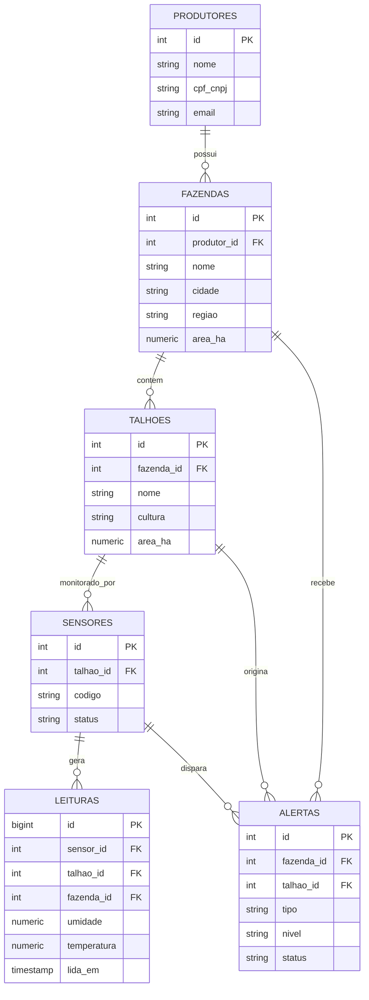

# Modelo Entidade-Relacionamento

```mermaid
erDiagram
    PRODUTORES ||--o{ FAZENDAS : possui
    FAZENDAS   ||--o{ TALHOES  : contem
    TALHOES    ||--o{ SENSORES : monitorado_por
    SENSORES   ||--o{ LEITURAS : gera
    FAZENDAS   ||--o{ ALERTAS  : recebe
    TALHOES    ||--o{ ALERTAS  : origina
    SENSORES   ||--o{ ALERTAS  : dispara

    PRODUTORES { int id PK  string nome  string cpf_cnpj  string email }
    FAZENDAS   { int id PK  int produtor_id FK  string nome  string cidade  string regiao  numeric area_ha }
    TALHOES    { int id PK  int fazenda_id FK  string nome  string cultura  numeric area_ha }
    SENSORES   { int id PK  int talhao_id FK  string codigo  string status }
    LEITURAS   { bigint id PK  int sensor_id FK  int talhao_id FK  int fazenda_id FK  numeric umidade  numeric temperatura  timestamp lida_em }
    ALERTAS    { int id PK  int fazenda_id FK  int talhao_id FK  string tipo  string nivel  string status }
```
